# Healthcare Data Warehouse on Snowflake

### Production-Grade ELT Pipeline · Airflow · dbt · Snowflake · Great Expectations · Power BI


---

## Overview

End-to-end healthcare data warehouse ingesting CMS Medicare public claims data into Snowflake, orchestrated with Apache Airflow, transformed with dbt, validated with Great Expectations, and visualized in Power BI.

**Dataset:** CMS Medicare Physician & Other Practitioners — 2022 (~9.6M raw rows, 3GB)

---

## Table of Contents
- [Architecture Overview](#architecture-overview)
- [Tech Stack](#tech-stack)
- [Dataset](#dataset)
- [Phase 1 — Snowflake Environment Setup](#phase-1--snowflake-environment-setup)
- [Phase 2 — Data Ingestion](#phase-2--data-ingestion)
- [Phase 3 — dbt Transformations](#phase-3--dbt-transformations)
- [Phase 4 — Data Quality with Great Expectations](#phase-4--data-quality-with-great-expectations)
- [Phase 5 — Orchestration with Airflow](#phase-5--orchestration-with-airflow)
- [Phase 6 — Power BI Dashboard](#phase-6--power-bi-dashboard)
- [Snowflake Advanced Features](#snowflake-advanced-features)
- [Repository Structure](#repository-structure)
- [Local Setup](#local-setup)

---

## Architecture Overview

```
CMS Medicare Public Data (3GB CSV)
           │
           ▼
   Python Ingestion Layer
   (snowflake-connector-python)
           │
           ▼
┌─────────────────────────────────┐
│         SNOWFLAKE               │
│  ┌───────────────────────────┐  │
│  │  RAW Schema               │  │
│  │  RAW_CLAIMS (750K+ rows)  │  │
│  │  RAW_PROVIDERS            │  │
│  │  RAW_PROCEDURES           │  │
│  └───────────┬───────────────┘  │
│              │ dbt              │
│  ┌───────────▼───────────────┐  │
│  │  STAGING Schema           │  │
│  │  stg_claims (view)        │  │
│  │  stg_providers (view)     │  │
│  │  stg_procedures (view)    │  │
│  └───────────┬───────────────┘  │
│              │ dbt              │
│  ┌───────────▼───────────────┐  │
│  │  MARTS Schema             │  │
│  │  fct_claims               │  │
│  │  dim_providers            │  │
│  │  dim_procedures           │  │
│  │  dim_geography            │  │
│  │  dim_date                 │  │
│  └───────────────────────────┘  │
└─────────────────────────────────┘
           │
           ├── Great Expectations (DQ validation)
           ├── Airflow (orchestration)
           └── Power BI (visualization)
```

---

## Tech Stack

| Layer | Technology |
|-------|-----------|
| Cloud Data Warehouse | Snowflake (X-Small warehouse, auto-suspend) |
| Ingestion | Python, snowflake-connector-python, pandas |
| Orchestration | Apache Airflow 2.9 (Docker, LocalExecutor) |
| Transformation | dbt 1.7 (Snowflake adapter) |
| Data Quality | Great Expectations 1.x |
| Visualization | Power BI (Web, DAX measures) |
| Infrastructure | Docker, docker-compose |
| Language | Python 3.12 |

---

## Dataset

**Source:** CMS Medicare Physician & Other Practitioners by Provider and Service (2022)  
**URL:** [data.cms.gov](https://data.cms.gov/provider-summary-by-type-of-service/medicare-physician-other-practitioners)  
**Size:** ~3GB CSV, 9.6M raw rows  
**Loaded:** 750K claims, 91K providers, 4.2K procedures (representative sample)

The CMS Medicare dataset contains 100% final-action physician/supplier Part B non-institutional claims for the Medicare fee-for-service population, organized by NPI, HCPCS code, and place of service.

---

## Phase 1 — Snowflake Environment Setup

Provisioned a full production-grade Snowflake environment with proper RBAC, schema separation, and cost controls.

**What was built:**
- `HEALTHCARE_DW` database with three schemas: `RAW`, `STAGING`, `MARTS`
- `HEALTHCARE_WH` virtual warehouse (X-Small, auto-suspend 60s, auto-resume)
- `TRANSFORMER` role (dbt/Airflow service account) and `REPORTER` role (Power BI read-only)
- Time Travel enabled on RAW schema (7-day retention)
- CDC Stream on `RAW_CLAIMS` with hourly Task for micro-batch processing

```sql
CREATE WAREHOUSE HEALTHCARE_WH
    WAREHOUSE_SIZE   = 'X-SMALL'
    AUTO_SUSPEND     = 60
    AUTO_RESUME      = TRUE
    INITIALLY_SUSPENDED = TRUE;

CREATE DATABASE HEALTHCARE_DW;
CREATE SCHEMA HEALTHCARE_DW.RAW;
CREATE SCHEMA HEALTHCARE_DW.STAGING;
CREATE SCHEMA HEALTHCARE_DW.MARTS;

ALTER SCHEMA HEALTHCARE_DW.RAW
    SET DATA_RETENTION_TIME_IN_DAYS = 7;
```

---

## Phase 2 — Data Ingestion

Python ingestion pipeline loading CMS Medicare flat files into Snowflake RAW schema using `write_pandas()` for efficient bulk loading.

**Key implementation details:**
- Chunked CSV reading (50K rows per chunk) to handle 3GB file without memory issues
- Idempotent loads with `load_date` metadata column
- Schema drift detection — flags missing columns across CMS annual releases
- Row count logging before/after each load for audit trail

```python
for chunk in pd.read_csv(csv_path, chunksize=50_000):
    write_pandas(conn, chunk, table_name, database=db, schema=schema)
```

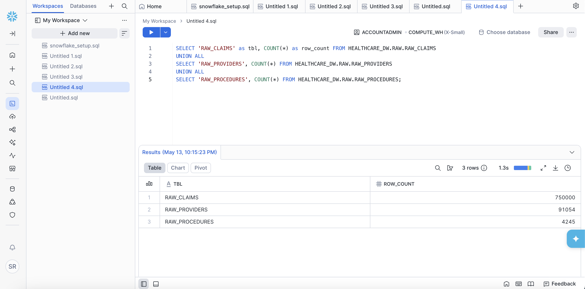
*750K claims, 91K providers, and 4.2K procedures loaded into Snowflake RAW schema*

---

## Phase 3 — dbt Transformations

Full dbt project following the raw → staging → marts medallion pattern with comprehensive test coverage and column-level documentation.

### Star Schema Design

```
                    ┌─────────────────┐
                    │   dim_date      │
                    │  (2,192 rows)   │
                    └────────┬────────┘
                             │
┌──────────────┐    ┌────────▼────────┐    ┌─────────────────┐
│ dim_providers│◄───│   fct_claims    │───►│ dim_procedures  │
│  (91K rows)  │    │  (723K rows)    │    │  (4.2K rows)    │
└──────────────┘    └────────┬────────┘    └─────────────────┘
                             │
                    ┌────────▼────────┐
                    │  dim_geography  │
                    │   (59 rows)     │
                    └─────────────────┘
```

### Models

| Model | Type | Description |
|-------|------|-------------|
| `stg_claims` | View | Renamed + typed RAW_CLAIMS |
| `stg_providers` | View | Renamed + typed RAW_PROVIDERS |
| `stg_procedures` | View | Renamed + typed RAW_PROCEDURES |
| `fct_claims` | Table | Grain: NPI × HCPCS × place_of_service × year |
| `dim_providers` | Table | SCD Type 1, latest year per NPI |
| `dim_procedures` | Table | HCPCS code reference with category |
| `dim_geography` | Table | State → census region → urban/rural |
| `dim_date` | Table | Date spine 2019–2024 |

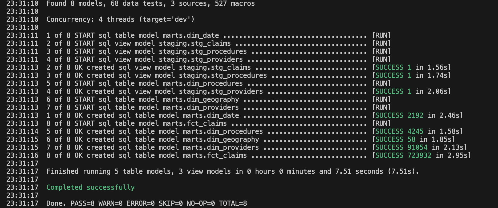
*All 8 dbt models created successfully across staging and marts layers*

### Test Coverage — 66 Tests, 0 Failures

Tests include `not_null` on all PKs/FKs, `unique` on all PKs, `accepted_values` on categoricals, `relationships` for FK integrity, and two custom singular tests.

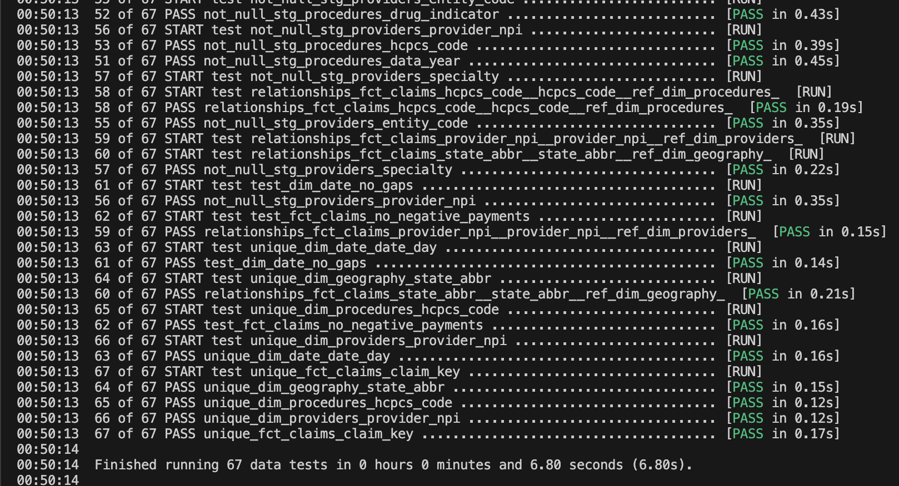
*66 data tests passing — schema integrity fully validated across all 8 models*

### Lineage DAG

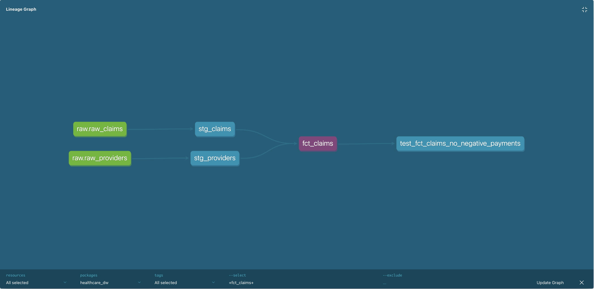
*Full data lineage from RAW sources through staging views to mart tables — generated by `dbt docs generate`*

---

## Phase 4 — Data Quality with Great Expectations

Automated data quality validation running on every pipeline execution. If any expectation fails, Airflow halts the pipeline before dbt runs — preventing bad data from reaching the marts layer.

### Expectations Suite

| Expectation | Result |
|------------|--------|
| Row count between 1K and 10M | ✅ PASS |
| NPI not null | ✅ PASS |
| HCPCS code not null | ✅ PASS |
| Place of service not null | ✅ PASS |
| Place of service in {F, O} | ✅ PASS |
| Total services not null | ✅ PASS |
| Avg Medicare payment between 0 and $500K | ✅ PASS |

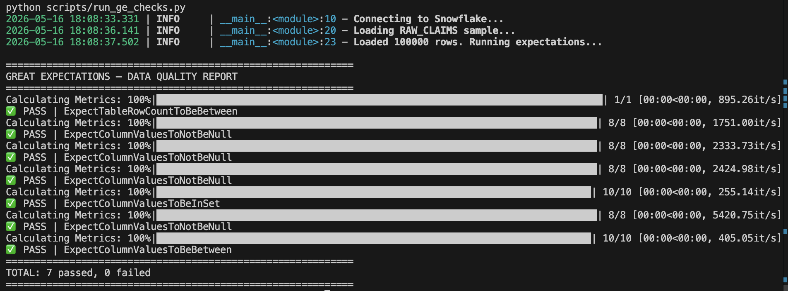
*7/7 data quality checks passing on 100K row sample of RAW_CLAIMS*

---

## Phase 5 — Orchestration with Airflow

Full pipeline orchestrated by Apache Airflow 2.9 running via Docker with LocalExecutor.

### DAG: `healthcare_dw_daily` — Schedule: 06:00 UTC Daily

```
check_cms_source → ingest_raw_data → run_ge_raw_checks → dbt_staging_run → dbt_marts_run → dbt_test → ge_marts_check → notify_success
```

| Task | Type | Description |
|------|------|-------------|
| `check_cms_source` | EmptyOperator | Source availability check |
| `ingest_raw_data` | PythonOperator | CMS CSV → Snowflake RAW (halts on S3 error) |
| `run_ge_raw_checks` | PythonOperator | GE validation — **halts DAG on failure** |
| `dbt_staging_run` | BashOperator | Rebuilds staging views |
| `dbt_marts_run` | BashOperator | Rebuilds all 5 mart tables |
| `dbt_test` | BashOperator | Runs all 66 dbt tests |
| `ge_marts_check` | PythonOperator | Row count validation on marts |
| `notify_success` | EmptyOperator | Placeholder for Slack/PagerDuty |

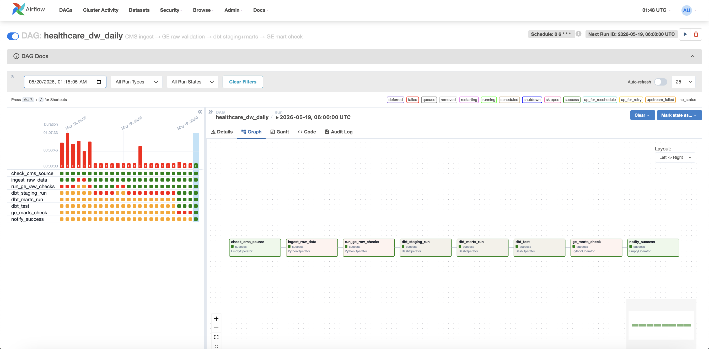
*Full pipeline run completing successfully — all 8 tasks green in sequence*

---

## Phase 6 — Power BI Dashboard

Three-page executive dashboard connected directly to Snowflake MARTS schema.

### Data Model

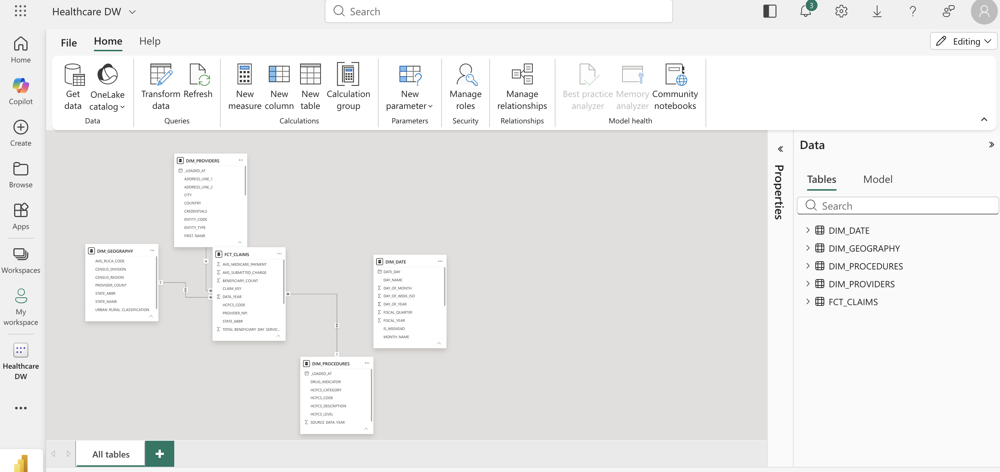
*Star schema in Power BI model view — FCT_CLAIMS at center with explicit relationships to all four dimension tables*

### DAX Measures

```dax
Total Reimbursement = SUM(FCT_CLAIMS[TOTAL_MEDICARE_PAYMENT])

Provider Count = DISTINCTCOUNT(FCT_CLAIMS[PROVIDER_NPI])

Avg Cost Per Claim = DIVIDE(
    SUM(FCT_CLAIMS[TOTAL_MEDICARE_PAYMENT]),
    SUM(FCT_CLAIMS[TOTAL_SERVICES])
)

Provider Share % = DIVIDE(
    [Total Reimbursement],
    CALCULATE([Total Reimbursement], ALL(DIM_PROVIDERS))
)
```

### Page 1 — Executive Overview

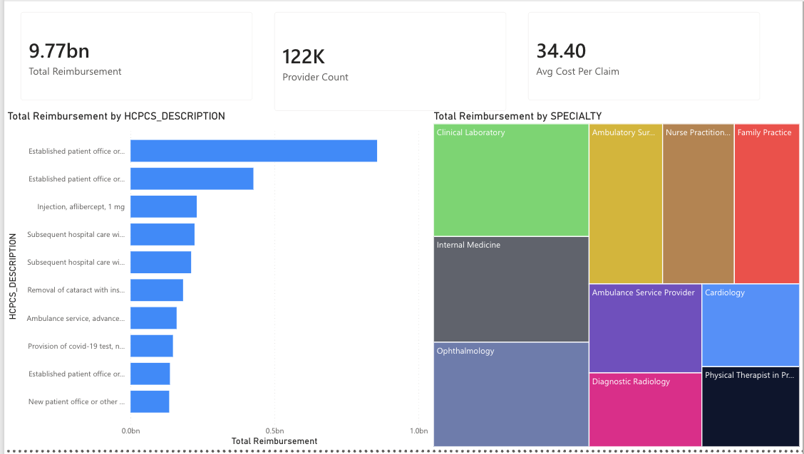

**$9.77bn** total Medicare reimbursement | **122K** unique providers | **$34.40** avg cost per claim

Key insights: Office visits (99213/99214) dominate spending at $1bn+. Aflibercept injections (macular degeneration) rank top-3 by cost. Internal Medicine and Clinical Laboratory lead by specialty reimbursement.

### Page 2 — Geographic Analysis

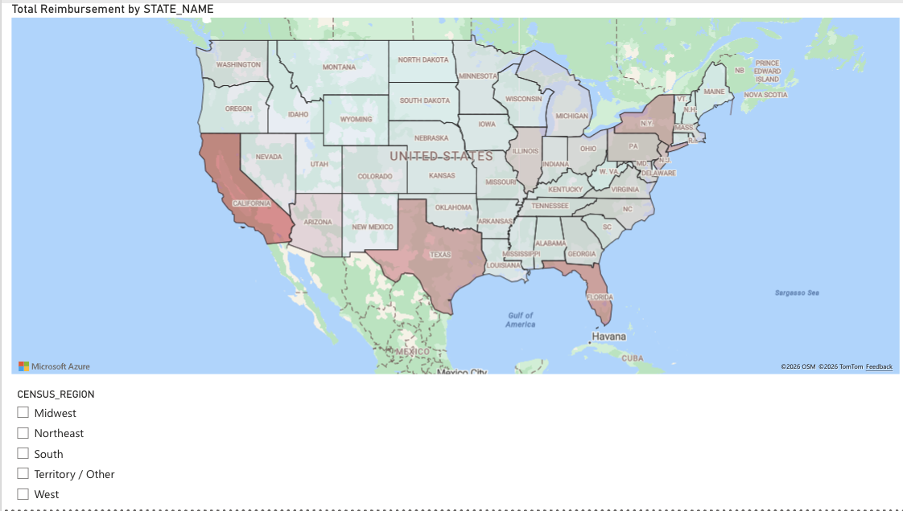

Choropleth map with gradient shading by reimbursement — California, Texas, and Florida as highest-spend states. Interactive census region slicer filters the map in real time.

### Page 3 — Provider Deep Dive

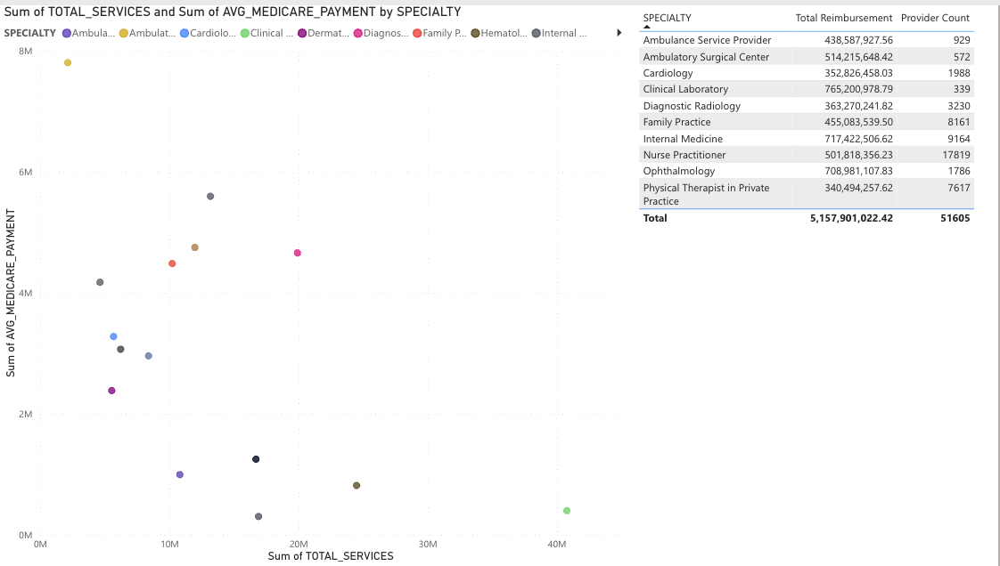

Scatter plot of total services vs avg Medicare payment by specialty — identifies high-volume/low-cost vs low-volume/high-cost patterns. Table shows top 10 specialties with **$5.1bn** total reimbursement across **51K** providers.

---

## Snowflake Advanced Features

### Time Travel

```sql
SELECT COUNT(*) FROM HEALTHCARE_DW.RAW.RAW_CLAIMS
AT(OFFSET => -3600);
```

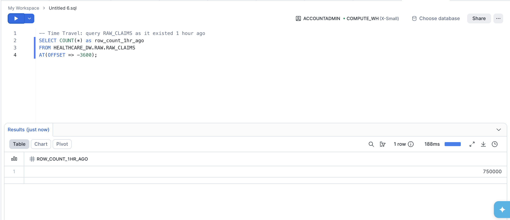

### Zero-Copy Cloning

```sql
CREATE DATABASE DEV_HEALTHCARE_DW CLONE HEALTHCARE_DW;
```

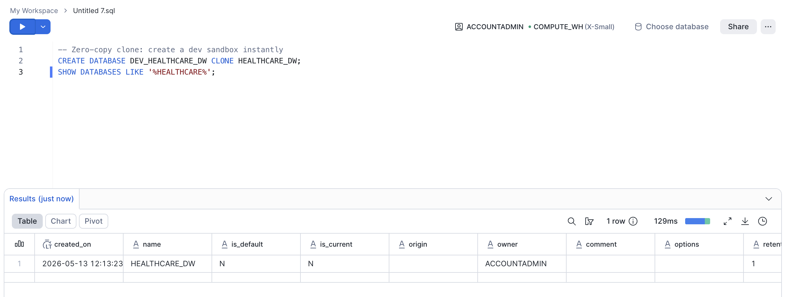

### Star Schema Validation Query

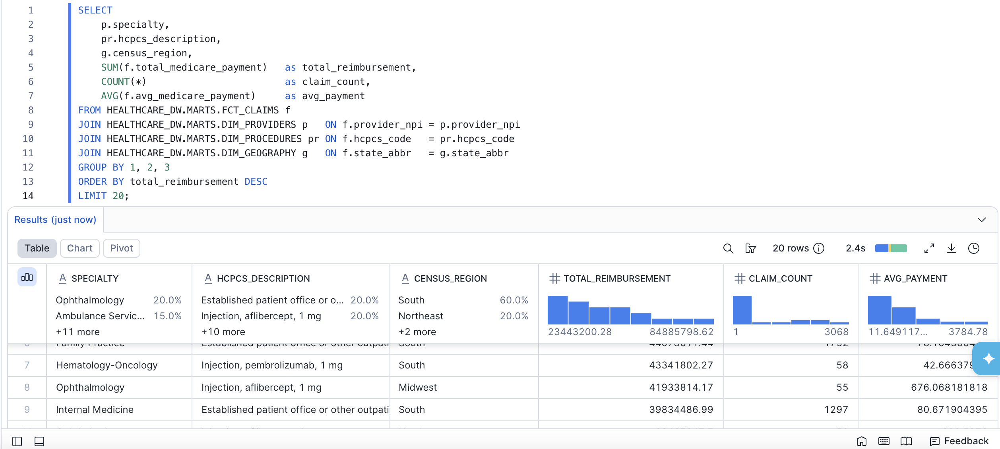
*4-table join returning top reimbursement combinations — Ophthalmology aflibercept injections in the South leading at $84M*

### Streams + Tasks (CDC)

```sql
CREATE STREAM HEALTHCARE_DW.RAW.CLAIMS_STREAM
    ON TABLE HEALTHCARE_DW.RAW.CLAIMS
    APPEND_ONLY = TRUE;

CREATE TASK HEALTHCARE_DW.RAW.PROCESS_CLAIMS_TASK
    WAREHOUSE = HEALTHCARE_WH
    SCHEDULE  = '60 MINUTE'
    WHEN SYSTEM$STREAM_HAS_DATA('HEALTHCARE_DW.RAW.CLAIMS_STREAM')
AS
    MERGE INTO HEALTHCARE_DW.STAGING.CLAIMS AS tgt
    USING (SELECT * FROM HEALTHCARE_DW.RAW.CLAIMS_STREAM
           WHERE METADATA$ACTION = 'INSERT') AS src
    ON tgt.claim_id = src.claim_id
    WHEN NOT MATCHED THEN INSERT ...;
```

---

## Repository Structure

```
healthcare-dw/
├── ingestion/
│   ├── cms_ingest.py
│   └── base.py
├── dbt_project/
│   ├── models/
│   │   ├── staging/
│   │   └── marts/
│   ├── tests/
│   ├── macros/
│   └── dbt_project.yml
├── airflow/
│   ├── dags/healthcare_pipeline_dag.py
│   ├── Dockerfile
│   └── requirements.txt
├── scripts/
│   ├── snowflake_setup.sql
│   ├── create_raw_tables.py
│   └── run_ge_checks.py
├── portfolio_screenshots/
├── docker-compose.yml
├── .env.example
└── README.md
```

---

## Local Setup

### Prerequisites
- Python 3.12+, Docker Desktop
- Snowflake free trial (snowflake.com/try)
- Power BI account (app.powerbi.com with work/school email)

```bash
git clone https://github.com/YOUR_USERNAME/healthcare-dw.git
cd healthcare-dw
pip install -r requirements.txt
cp .env.example .env        # fill in Snowflake credentials
```

Run Snowflake setup SQL in Snowsight, then:

```bash
python scripts/create_raw_tables.py
python -m ingestion.cms_ingest

export $(cat .env | grep -v '^#' | xargs)
dbt run --project-dir dbt_project --profiles-dir dbt_project
dbt test --project-dir dbt_project --profiles-dir dbt_project

python scripts/run_ge_checks.py

cd airflow && docker-compose up -d
# http://localhost:8080 → trigger healthcare_dw_daily
```

---

## Key Results

| Metric | Value |
|--------|-------|
| Raw records loaded | 750K claims, 91K providers, 4.2K procedures |
| dbt models | 8 (3 staging views + 5 mart tables) |
| dbt tests | 66 passing, 0 failures |
| GE expectations | 7/7 passing |
| Total Medicare reimbursement | $9.77 billion |
| Unique providers | 122,000 |
| Avg cost per claim | $34.40 |

---

*Built with CMS Medicare public data. All figures represent 2022 Medicare fee-for-service Part B claims.*